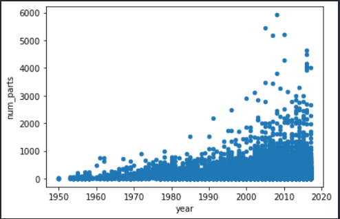

# Analyse de Historique de Lego

clicker sur le lien binder pour faire l'execution de projet

<h2>ci-joint le shema de dataset</h2>

<h1>Intorduction</h1>
<h3> On a étudié dans ce projet l'influence du deux facteurs (couleur et thèmes)  pour augmenter le vent de Lego aux cours d'année.</h3>

<h1>la courbe de vent de Lego aux cours des années<h1>

<h5>La courbe de vent est croisant On va voir pourquoi ? </h5>

<h1>Influence du couleur<h1>
<h4> on remarque l'existence de :<i style="color:red">135</i> couleur Et ces couleurs sont divisées ont deux catégories, la première est les couleurs transparentes et l'autre sont les couleurs non transparentes  et on a trouvé que le nombre des couleurs non transparent est dominant d'après la statistique </h4>

<h1>Influence de thèmes <h1>
<h4>On remarque que les thèmes a un certain  lien d'augmentation de vent de Lego aux cours de l'année, car le nombre de thèmes utilisé augmente au cours de temps et vent aussi alors, il y a une  liassent entre les thèmes et le vente. </h4>

